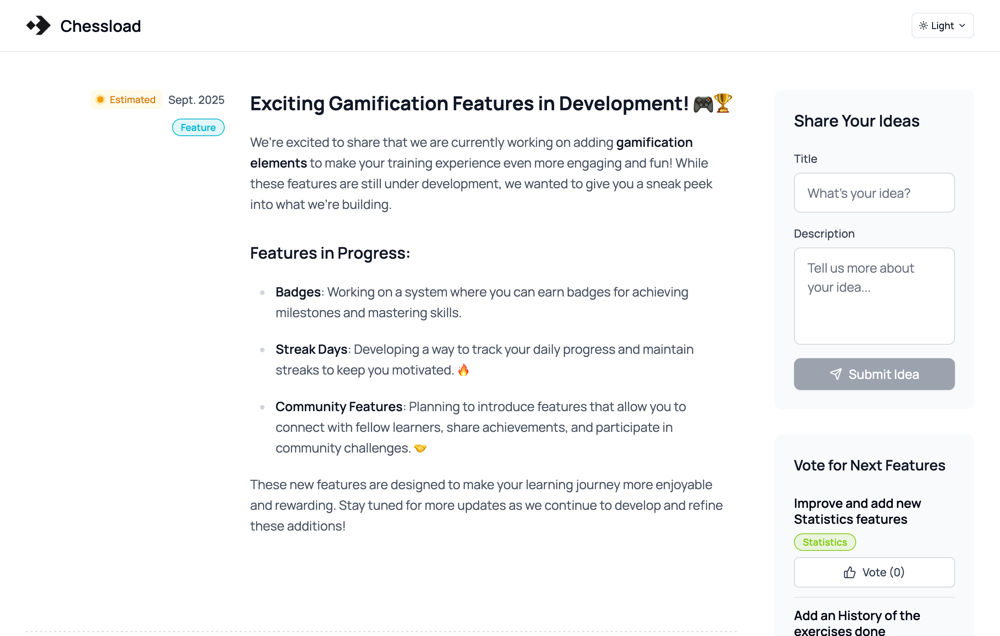
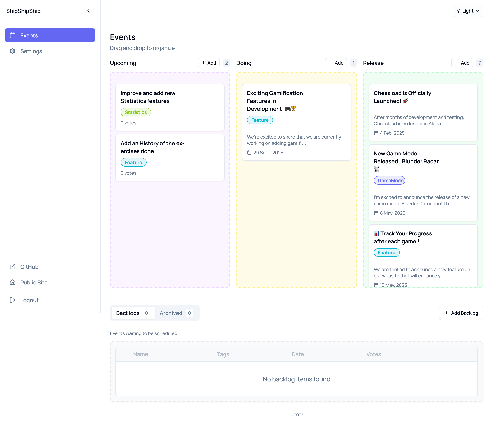

# 🚢 ShipShipShip

A modern, self-hostable changelog and roadmap platform that helps you share product updates with your community and gather feedback through feature voting.

**🔗 [Live Demo](https://changelogs.chessload.com/)**


## ✨ Features

- 📋 **Rich Changelog Management** - Create, edit, and organize events with Markdown support and rich text editor
- 🗳️ **Community Voting** - Let users vote on upcoming features and gather feedback
- 📊 **Kanban Roadmap** - Drag-and-drop board with multiple event statuses (Backlog, Vote, Doing, Released, etc.)
- 🎨 **Modern Interface** - Responsive design with dark/light themes and real-time updates
- 🛠️ **Self-Hostable** - Complete control over your data with Docker deployment
- 🔌 **RESTful API** - Full API access for integrations and custom workflows

## 📸 Screenshots

### Public Page
The main changelog and roadmap interface that your users will see:



### Admin Dashboard
The administrative interface for managing events and settings:



## 🏗️ Tech Stack

**Frontend:** SvelteKit, TailwindCSS, Shadcn/ui  
**Backend:** Go (Gin), SQLite, GORM, JWT  
**Deployment:** Docker, Multi-stage builds

## 🚀 Quick Start

```bash
# Clone and start with Docker
git clone https://github.com/GauthierNelkinsky/ShipShipShip.git
cd ShipShipShip
docker-compose up -d

# Access at http://localhost:8080
# Default credentials: admin/admin (change immediately!)
```

## ⚙️ Configuration

### Environment Variables

| Variable | Default | Description |
|----------|---------|-------------|
| `ADMIN_USERNAME` | `admin` | Admin login username |
| `ADMIN_PASSWORD` | `admin` | Admin login password |
| `JWT_SECRET` | `your-secret-key-change-in-production` | JWT signing secret |
| `PORT` | `8080` | Server port |
| `DB_PATH` | `./data/changelog.db` | SQLite database path |

### Docker Compose Example

```yaml
version: "3.8"
services:
  changelog:
    image: shipshipship:latest
    ports:
      - "8080:8080"
    environment:
      - ADMIN_USERNAME=youradmin
      - ADMIN_PASSWORD=securerpassword
      - JWT_SECRET=your-jwt-secret-change-this
      - GIN_MODE=release
    volumes:
      - changelog_data:/app/data
    restart: unless-stopped

volumes:
  changelog_data:
```

## 📊 Event Statuses

- **📝 Backlog** - Ideas and planned features
- **🗳️ Vote** - Features users can vote on
- **🔄 Doing** - Currently in development
- **🚀 Released** - Published features (main timeline)
- **📅 Upcoming** - Planned releases
- **📦 Archived** - Internal events (hidden from public)

## 🔌 API Endpoints

### Public
- `GET /api/events` - Get all public events
- `POST /api/events/:id/vote` - Vote for an event
- `POST /api/auth/login` - Admin login

### Admin (JWT Required)
- `GET /admin/events` - Get all events (including archived)
- `POST /admin/events` - Create new event
- `PUT /admin/events/:id` - Update event
- `DELETE /admin/events/:id` - Delete event
- `GET/PUT /admin/settings` - Manage settings

## 🛠️ Development

```bash
# Development mode
./start-dev.sh

# Manual setup
cd backend && go run main.go &
cd frontend && npm run dev
```

## 🔒 Security Checklist

- [ ] Change default admin credentials
- [ ] Set strong JWT secret
- [ ] Use HTTPS in production
- [ ] Regular database backups
- [ ] Update dependencies regularly

## 📝 License

This project is licensed under the Apache 2.0 License - see the [LICENSE](LICENSE) file for details.

## 🔗 Links

- **GitHub**: [https://github.com/GauthierNelkinsky/ShipShipShip](https://github.com/GauthierNelkinsky/ShipShipShip)
- **Issues**: [Report bugs or request features](https://github.com/GauthierNelkinsky/ShipShipShip/issues)
- **Demo**: [https://changelogs.chessload.com/](https://changelogs.chessload.com/)

---

**Shipped with ShipShipShip** 🚢